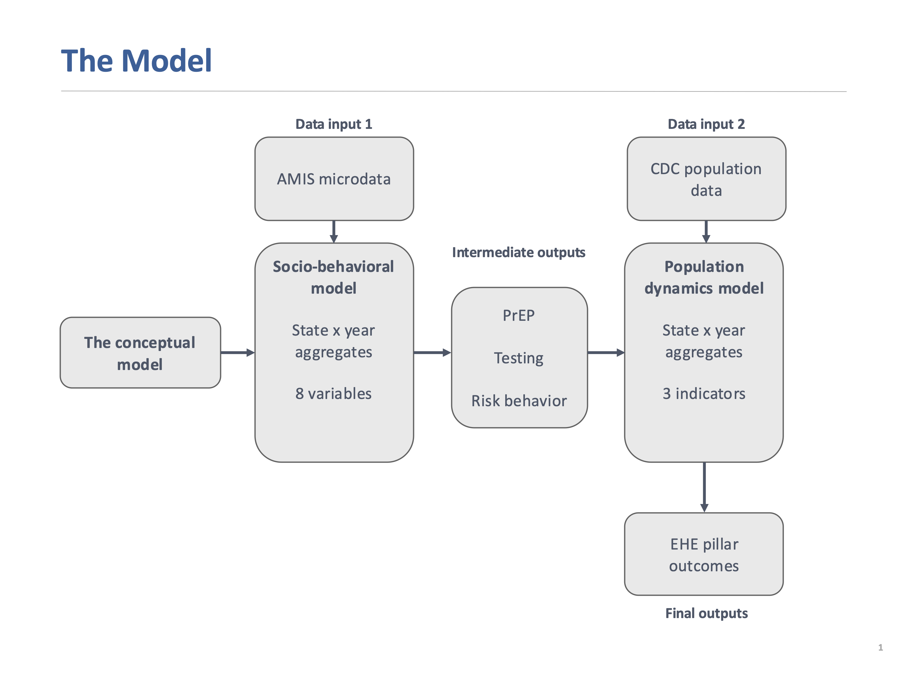

# System Dynamics Prediction Model for StigmaScope

This model captures socio-behavioral and stigma-related dynamics that shape HIV epidemiological outcomes for men who have sex with men (MSM).

This repository contains the prediction runtime that will be integrated into the [StigmaScope.com](https://stigmascope.com) dashboard for the Ending the HIV Epidemic initiative.

## Overview
### Model Diagram



The runtime produces forward projections for all variables in the socio-behavioral model (SEM) and population dynamics model (Epi).

### Socio-behavioral variables (proportion in population)

- anticipated healthcare stigma
- general social stigma
- family stigma
- seeing a healthcare provider annually
- sexual orientation disclosure to a healthcare provider
- risk behavior
- use of PrEP in the past year
- HIV testing in the past year

### Population dynamics outputs (counts)

- annual PrEP use
- HIV diagnoses
- estimated HIV incidence

The runtime reads prepared standardized inputs and parameters, and supports deterministic and uncertainty prediction for user-specified forecast years under baseline and intervention scenarios.

## Runtime Flow: Inputs -> Model -> Outputs

### 1. Input

Required file:
- `standardized_input_v8.npz`

This is the current standardized runtime artifact. Older `standardized_input.npz` / v7 artifacts are legacy inputs and do not contain the centered-logit SEM drift fields required by the current runtime.

Details on the file structure are below. 

### 2. Model

Execution path:
- `cli.py` parses arguments
- `runner.py` dispatches deterministic or uncertainty mode
- `input/standardized_runtime.py` reads `standardized_input_v8.npz`
- `prediction/joint.py` runs SEM + CDC coupling
- `prediction/intervention.py` applies intervention effects when enabled

### 3. Output

Runtime returns in-memory dataclasses from `output/types.py`:
- deterministic: `JointOutput`
- uncertainty: `UncertaintyOutput`

Optional outputs:
- `--save <path>` writes pickle output
- `--plot` writes PNGs

## Project Structure

### Primary Runtime Files
- `standardized_input_v8.npz`: required runtime input
- `cli.py`: command-line entrypoint
- `config.py`: runtime configuration and validation
- `runner.py`: orchestration (`run_prediction`)
- `alignment.py`: year alignment and CDC input derivation utilities
- `plotting.py`: six-panel plotting per unit
- `requirements.txt`: dependencies

### Source Tree

```text
.
├── cli.py
├── config.py
├── runner.py
├── alignment.py
├── plotting.py
├── requirements.txt
├── standardized_input_v8.npz
├── input/
│   ├── __init__.py
│   ├── loaders.py
│   └── standardized_runtime.py
├── prediction/
│   ├── __init__.py
│   ├── codebooks.py
│   ├── epi_predictor.py
│   ├── intervention.py
│   ├── joint.py
│   ├── sem_predictor.py
│   └── transforms.py
├── output/
│   ├── __init__.py
│   ├── io.py
│   └── types.py
└── data/
    ├── __init__.py
    ├── params_cdc.py
    ├── params_sem.py
    └── unit.py
```

## `standardized_input_v8.npz` Schema

The current v8 artifact is `standardized_input_v8.npz`. It contains 49 geographies, 8 SEM variables, 500 SEM uncertainty draws, and 2000 CDC posterior draws.

### Schema Blocks
- index metadata (what each axis means)
- year axes (what timelines exist)
- SEM observed trajectories and fitted SEM parameters
- CDC raw input series
- CDC posterior parameter samples
- centered-logit SEM reference probabilities and drift terms

### Axis Symbols
- `G`: number of geographies
- `M`: number of SEM variables
- `K`: number of CDC raw variables
- `S_sem`: number of SEM posterior samples
- `S_cdc`: number of CDC posterior samples
- `T_sem_obs`: SEM observed years
- `T_sem_pred`: SEM prediction years
- `T_cdc_obs`: observed CDC years
- `T_model`: CDC model years used for simulation

### Index Metadata

- `schema_version` `(1,)`: schema/version tag
- `geo_ids` `(G,)`: geography IDs (for example `NY`, `CA`, ...)
- `sem_v_names` `(M,)`: SEM variable names (for example `hivtest12`, `prep_used`)
- `cdc_raw_names` `(K,)`: CDC raw variable names (for example `HIV diagnoses`, `PrEP`)

### Year Axes

- `sem_obs_years` `(T_sem_obs,)`: years where SEM observations exist
- `sem_pred_years` `(T_sem_pred,)`: years for SEM trajectory rollout
- `cdc_native_years` `(T_cdc_obs,)`: native observed CDC years
- `model_years` `(T_model,)`: CDC simulation years (can extend beyond native years)

### SEM Block

- `sem_obs` `(G, M, T_sem_obs)`: observed SEM values
- `sem_pred` `(G, M, T_sem_pred)`: baseline SEM trajectory values
- `sem_reference_probs` `(M,)`: reference probabilities used to center the SEM logit state space
- `sem_fit_J_last` `(G, M, M)`: fitted SEM matrix used for deterministic rollout
- `sem_fit_drift` `(G, M)`: fitted SEM drift vector used for deterministic rollout
- `sem_J_samples` `(S_sem, G, M, M)`: SEM posterior samples for uncertainty mode
- `sem_drift_samples` `(S_sem, G, M)`: SEM drift samples for uncertainty mode

The SEM runtime uses the centered-logit state

```text
x_t = logit(p_t) - logit(p_ref)
x_{t+1} = J_g x_t + c_g
p_t = inverse_logit(x_t + logit(p_ref))
```

where `J_g` is the geography-specific fitted SEM matrix and `c_g` is the geography-specific drift vector.

### CDC Raw Block

- `cdc_raw_native` `(G, K, T_cdc_obs)`: raw CDC series on observed years (used for plotting observed points and forecast split)
- `cdc_raw` `(G, K, T_model)`: CDC raw series aligned to model years (used in model computations)

### CDC Posterior and Fixed Parameter Block

- `cdc_beta` `(S_cdc, G)`: posterior samples for `beta`
- `cdc_alpha` `(S_cdc, G)`: posterior samples for `alpha`
- `cdc_kdx` `(S_cdc, G)`: posterior samples for `kdx`
- `cdc_U0` `(S_cdc, G)`: posterior samples for `U0`
- `cdc_post_multiplier` `(S_cdc, G)`: posterior multiplier samples used in the CDC prediction equation
- `cdc_kappa_prep` `(G,)`: per-geography PrEP scaling constant
- `cdc_risk0` `(G,)`: per-geography baseline CDC risk value used in the CDC prediction equation

### Exact v8 Keys

```text
schema_version          (1,)
geo_ids                 (49,)
model_years             (20,)
cdc_native_years        (6,)
sem_obs_years           (4,)
sem_pred_years          (4,)
sem_v_names             (8,)
cdc_raw_names           (6,)
sem_obs                 (49, 8, 4)
sem_pred                (49, 8, 4)
sem_fit_J_last          (49, 8, 8)
sem_fit_drift           (49, 8)
sem_reference_probs     (8,)
sem_J_samples           (500, 49, 8, 8)
sem_drift_samples       (500, 49, 8)
cdc_raw                 (49, 6, 20)
cdc_raw_native          (49, 6, 6)
cdc_beta                (2000, 49)
cdc_alpha               (2000, 49)
cdc_kdx                 (2000, 49)
cdc_U0                  (2000, 49)
cdc_post_multiplier     (2000, 49)
cdc_kappa_prep          (49,)
cdc_risk0               (49,)
```

## Setup

```bash
python3 -m venv .venv
source .venv/bin/activate
pip install -r requirements.txt
```

## Run Commands

- Assumption: `standardized_input_v8.npz` exists at repo root.

### CLI Options

- `--standardized-input <path>`: path to standardized input file (default: `standardized_input_v8.npz`)
- `--mode {deterministic,uncertainty}`: run type
- `--scenario-mode {baseline,intervention}`: scenario to run
- `--target-end-year <year>`: truncate forecast horizon to this year (must be <= max year in input)
- `--units <id1 id2 ...>`: run only selected geographies (for example `NY CA`)
- `--n-samples <int>`: Monte Carlo sample count (uncertainty mode)
- `--seed <int>`: random seed (uncertainty mode)
- `--state-codes <code1 code2 ...>`: state intervention codes (intervention scenario)
- `--relationship-codes <code1 code2 ...>`: relationship intervention codes (intervention scenario)
- `--save <path>`: save runtime output as pickle
- `--plot`: generate plots
- `--plot-dir <path>`: directory for generated plots (default: `plots`)
- `--plot-units <id1 id2 ...>`: plot subset of units (defaults to run units)
- `--plot-compare-baseline`: overlay opposite scenario in plots

### Examples

Deterministic baseline run:

```bash
python -m cli --mode deterministic --scenario-mode baseline --units NY
```

Deterministic intervention run:

```bash
python -m cli \
  --mode deterministic \
  --scenario-mode intervention \
  --units NY \
  --state-codes reduce_ahs \
  --relationship-codes weaken_ahs_to_hivtest
```

Uncertainty run:

```bash
python -m cli --mode uncertainty --scenario-mode baseline --units NY --n-samples 500 --seed 123
```

Custom standardized input path:

```bash
python -m cli --standardized-input /path/to/standardized_input_v8.npz --mode deterministic --units NY
```

## Plotting

### Baseline Plot

```bash
python -m cli --mode deterministic --scenario-mode baseline --units NY --plot --plot-dir plots
```

### Intervention With Baseline Overlay

```bash
python -m cli \
  --mode deterministic \
  --scenario-mode intervention \
  --units NY \
  --state-codes reduce_ahs \
  --relationship-codes weaken_ahs_to_hivtest \
  --plot --plot-compare-baseline --plot-dir plots
```

### Uncertainty Plot

```bash
python -m cli --mode uncertainty --units NY --n-samples 100 --plot --plot-dir plots
```

### Plot Contents

- Each figure has 6 panels:
- SEM testing
- SEM prep use
- SEM risk behavior
- CDC incidence
- CDC diagnosed
- CDC prep on

### Output Filenames
- no comparison: `plots/<UNIT>_<mode>_<scenario>.png`
- comparison: `plots/<UNIT>_<mode>_comparison.png`

## Interventions

Definition file:
- `prediction/codebooks.py`

State codes apply variable-level probability changes. Current stigma-reduction scenarios reduce the target stigma probability by 50% relative to the baseline SEM trajectory for that geography.

Relationship codes modify SEM coupling terms in `J`. Weakening scenarios attenuate a pathway by 50%; strengthening scenarios multiply a pathway by 1.5.

All interventions ramp over `RuntimeConfig.intervention_duration_steps` SEM steps. The default is 3 SEM steps. This is intentionally configured in `config.py` rather than exposed as a CLI option.

If a code references a variable not present in `sem_v_names`, that intervention is skipped.

### Current State Intervention Codes

- `reduce_ahs`: reduce anticipated healthcare stigma by 50%
- `reduce_gss`: reduce general social stigma by 50%
- `reduce_family_stigma`: reduce family stigma by 50%

### Current Relationship Intervention Codes

- `weaken_ahs_to_prep`: weaken AHS -> PrEP pathway by 50%
- `weaken_ahs_to_disclosure`: weaken AHS -> outness pathway by 50%
- `strengthen_outness_to_prep`: strengthen outness -> PrEP linkage by 50%
- `strengthen_outness_to_hivtest`: strengthen outness -> HIV testing linkage by 50%
- `strengthen_seehcp_to_hivtest`: strengthen healthcare -> HIV testing linkage by 50%
- `weaken_ahs_to_hivtest`: weaken AHS -> HIV testing pathway by 50%
- `strengthen_seehcp_to_lower_ahs`: strengthen healthcare -> lower AHS pathway by 50%
- `weaken_outness_to_ahs_feedback`: weaken outness -> AHS stigma feedback by 50%

### Intervention Examples

State intervention only:

```bash
python -m cli \
  --mode deterministic \
  --scenario-mode intervention \
  --units NY \
  --state-codes reduce_ahs
```

Relationship intervention only:

```bash
python -m cli \
  --mode deterministic \
  --scenario-mode intervention \
  --units NY \
  --relationship-codes weaken_ahs_to_hivtest
```

Combined state + relationship interventions:

```bash
python -m cli \
  --mode deterministic \
  --scenario-mode intervention \
  --units NY \
  --state-codes reduce_ahs reduce_gss \
  --relationship-codes weaken_ahs_to_prep weaken_ahs_to_hivtest
```

Intervention in uncertainty mode:

```bash
python -m cli \
  --mode uncertainty \
  --scenario-mode intervention \
  --units NY \
  --n-samples 500 \
  --seed 123 \
  --state-codes reduce_ahs \
  --relationship-codes weaken_ahs_to_hivtest
```

## Troubleshooting

### Missing Input File
- error: `Missing standardized input: ...`
- fix: place `standardized_input_v8.npz` at repo root or pass `--standardized-input <path>`

### Target Year Too Large
- error: `target_end_year=... exceeds standardized_input max year ...`
- fix: lower `--target-end-year` or use a standardized file with longer horizon

### Matplotlib Cache Warning
- harmless in restricted environments; plots still save successfully
